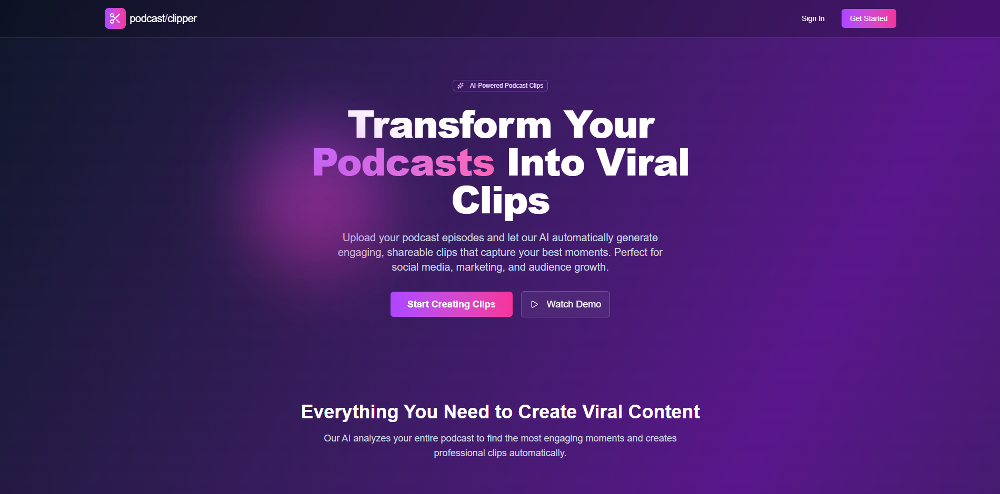

# AI Podcast Clipper

<div align="center">
    
    
    
    
    
    
    
    
</div>

## Overview

In this project, I have built a SaaS application that converts full podcast into viral
short-form clips ready for YouTube Shorts or TikTok. The tool uses different AI models to transcribe
the video, automatically detect the most engaging moments in podcasts and create clips cropped to the
active speaker's face. Project have built with user authentication, a credit-based payment system using Stripe,
and background processing queues to handle user load. I use technologies such as Next.js 15,
React, Typescript, Tailwind CSS, ShadCN, Auth.js, Python, FastAPI, Stripe, Modal, S3 on AWS, and more.

Feature:
- Auto-detection of viral moments in podcast (stories, questions, etc.)
- Automatically added subtitles on clips
- Transcription with m-brain/WhisperX
- Active speaker detection for video cropping with Junhua-Liao/LR-ASD
- Clips optimized for vertical platform (TikTok, YouTube Shorts)
- GPU-accelerated video rendering with FFMPEGCV
- LLM-powered viral moment identification with Gemini 2.5 Flash
- Queue system with Inngest for handling user load
- Credit-based system
- Stripe integration for credit pack purchases
- User authentication system
- Responsive Next.js web interface
- Dashboard to upload podcasts and see clips
- Inngest for handling long-running processes
- Serverless GPU processing with Modal
- FastAPI endpoint for podcast processing
- Modern UI with Tailwind CSS & Shadcn UI

AI model used in project (recommended reading)
- [LR-ASD: Lightweight and Robust Network for Active Speaker Detection](https://openaccess.thecvf.com/content/CVPR2023/papers/Liao_A_Light_Weight_Model_for_Active_Speaker_Detection_CVPR_2023_paper.pdf)
- [WhisperX: Time-Accurate Speech Transcription of Long-Form Audio](https://arxiv.org/pdf/2303.00747)
- Gemini 

## Setup

Follow these steps to install and set up the project.

**Clone the Repository**
```bash
git clone https://github.com/conbopk/AI-Podcast-Clipper-SaaS.git
```

**Install Python**

Download and install Python if not already installed. Use the link below for guidance on installation: [Python Download](https://www.python.org/downloads/)

Create a virtual environment with **Python 3.12.** 

**Backend**

Navigate to backend folder: 
```bash
cd backend
```

Install dependencies:
```bash
pip install -r requirements.txt
```

Clone the [LR-ASD](https://github.com/Junhua-Liao/LR-ASD) repo into the backend folder, and rename the folder asd:
```bash
git clone https://github.com/Junhua-Liao/LR-ASD.git
```

Modal setup:
```bash
modal setup
```

Run on Modal:
```bash
modal run main.py
```

Deploy backend:
```bash
modal deploy main.py
```

**Frontend**

Install dependencies:
```bash
cd frontend
npm i
```

Run:
```bash
npm run dev
```

**Queue**

Run the local queue development server with Inngest:
```bash
cd frontend
npm run inngest-dev
```

## AWS Setup
- Create your S3 bucket and setup CORS policy for this.
- Create IAM user for upload, download and list bucket items.

Example for IAM user setup:
```bash
{
    "Version": "2012-10-17",
    "Statement": [
        {
            "Effect": "Allow",
            "Action": [
                "s3:ListBucket"
            ],
            "Resource": "[S3 ARN here]"
        },
        {
            "Effect": "Allow",
            "Action": [
                "s3:GetObject",
                "s3:PutObject"
            ],
            "Resource": "[S3 ARN here]/*"
        }
    ]
}
```
